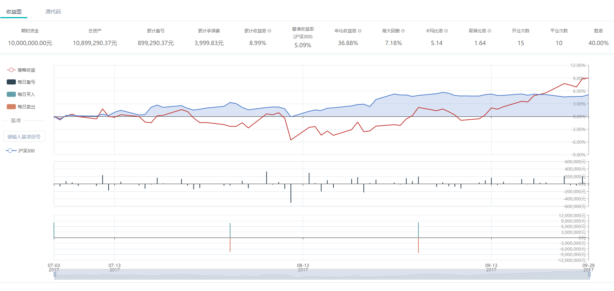

# 行业轮动(股票)
基于沪深300的行业指数的行业轮动策略

## 源码
```python
# coding=utf-8
from __future__ import print_function, absolute_import, unicode_literals
import numpy as np
from gm.api import *

'''
本策略每隔1个月定时触发计算SHSE.000910.SHSE.000909.SHSE.000911.SHSE.000912.SHSE.000913.SHSE.000914
(300工业.300材料.300可选.300消费.300医药.300金融)这几个行业指数过去
20个交易日的收益率,随后选取了收益率最高的指数的成份股中流通市值最大的5只股票
对不在股票池的股票平仓并等权配置股票池的标的
回测数据为:SHSE.000910.SHSE.000909.SHSE.000911.SHSE.000912.SHSE.000913.SHSE.000914和他们的成份股
回测时间为:2017-07-01 08:00:00到2017-10-01 16:00:00
'''


def init(context):
    # 每月第一个交易日的09:40 定时执行algo任务
    schedule(schedule_func=algo, date_rule='1m', time_rule='09:40:00')
    # 用于筛选的行业指数
    context.index = ['SHSE.000910', 'SHSE.000909', 'SHSE.000911', 'SHSE.000912', 'SHSE.000913', 'SHSE.000914']
    # 用于统计数据的天数
    context.count = 20
    # 最大下单资金比例
    context.ratio = 0.8


def algo(context):
    # 获取当天的日期
    today = context.now
    # 获取上一个交易日
    last_day = get_previous_trading_date(exchange='SHSE', date=today)
    return_index = []
    # 获取并计算行业指数收益率

    for i in context.index:
        return_index_his = history_n(symbol=i, frequency='1d', count=context.count, fields='close,bob',
                                     fill_missing='Last', adjust=ADJUST_PREV, end_time=last_day, df=True)
        return_index_his = return_index_his['close'].values
        return_index.append(return_index_his[-1] / return_index_his[0] - 1)
    # 获取指定数内收益率表现最好的行业
    sector = context.index[np.argmax(return_index)]
    print('最佳行业指数是: ', sector)
    # 获取最佳行业指数成份股
    symbols = get_history_constituents(index=sector, start_date=last_day, end_date=last_day)[0]['constituents'].keys()
    # 获取当天有交易的股票
    not_suspended_info = get_history_instruments(symbols=symbols, start_date=today, end_date=today)
    not_suspended_symbols = [item['symbol'] for item in not_suspended_info if not item['is_suspended']]

    # 获取最佳行业指数成份股的市值，从大到小排序并选取市值最大的5只股票
    fin = get_fundamentals(table='trading_derivative_indicator', symbols=not_suspended_symbols, start_date=last_day,
                           end_date=last_day, limit=5, fields='NEGOTIABLEMV', order_by='-NEGOTIABLEMV', df=True)
    fin.index = fin['symbol']
    # 计算权重
    percent = 1.0 / len(fin.index) * context.ratio
    # 获取当前所有仓位
    positions = context.account().positions()
    # 如标的池有仓位,平不在标的池的仓位
    for position in positions:
        symbol = position['symbol']
        if symbol not in fin.index:
            order_target_percent(symbol=symbol, percent=0, order_type=OrderType_Market,
                                 position_side=PositionSide_Long)
            print('市价单平不在标的池的', symbol)
    # 对标的池进行操作
    for symbol in fin.index:
        order_target_percent(symbol=symbol, percent=percent, order_type=OrderType_Market,
                             position_side=PositionSide_Long)
        print(symbol, '以市价单调整至仓位', percent)


if __name__ == '__main__':
    '''
    strategy_id策略ID,由系统生成
    filename文件名,请与本文件名保持一致
    mode实时模式:MODE_LIVE回测模式:MODE_BACKTEST
    token绑定计算机的ID,可在系统设置-密钥管理中生成
    backtest_start_time回测开始时间
    backtest_end_time回测结束时间
    backtest_adjust股票复权方式不复权:ADJUST_NONE前复权:ADJUST_PREV后复权:ADJUST_POST
    backtest_initial_cash回测初始资金
    backtest_commission_ratio回测佣金比例
    backtest_slippage_ratio回测滑点比例
    '''
    run(strategy_id='strategy_id',
        filename='main.py',
        mode=MODE_BACKTEST,
        token='token_id',
        backtest_start_time='2017-07-01 08:00:00',
        backtest_end_time='2017-10-01 16:00:00',
        backtest_adjust=ADJUST_PREV,
        backtest_initial_cash=10000000,
        backtest_commission_ratio=0.0001,
        backtest_slippage_ratio=0.0001)
```

## 绩效
